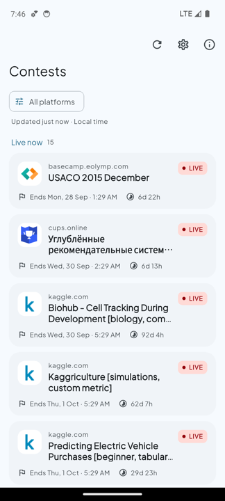
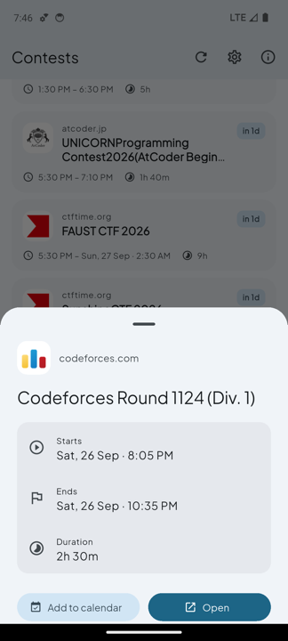
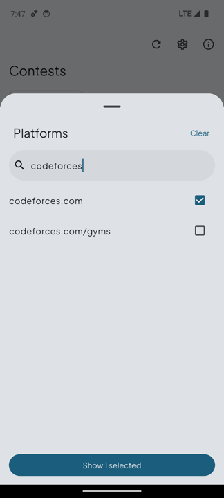
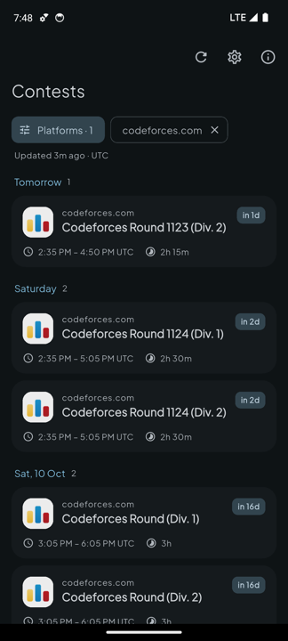

# CodeList

Every upcoming competitive programming contest in one list. CodeList pulls contests from 130+ platforms, including Codeforces, LeetCode, AtCoder and CodeChef, via the [clist.by](https://clist.by) API.

<a href="https://play.google.com/store/apps/details?id=developer.rohitsaw.codelist">Get it on Google Play</a>

<p>
  
  
  
  
</p>

## Features

- **Live and upcoming contests:** running contests first, then upcoming ones grouped by day (Today, Tomorrow, Saturday…), each with a countdown.
- **Platform filter:** search 130+ platforms and pick the ones you follow.
- **Add to calendar:** add any contest to your calendar, or open its page.
- **Works offline:** contests and platform logos are cached on the device. Pull down to refresh.
- **Local time or UTC:** show times in your time zone or in UTC.
- **Material You:** colours follow your wallpaper (Android 12+), with light, dark and system themes.

## Tech stack

| | |
|---|---|
| Framework | Flutter 3.47, Dart 3 |
| UI | Material 3, [`dynamic_color`](https://pub.dev/packages/dynamic_color), [`google_fonts`](https://pub.dev/packages/google_fonts) |
| Storage | [Hive](https://pub.dev/packages/hive) (offline cache and settings) |
| Networking | [`http`](https://pub.dev/packages/http), clist.by API v1 |
| Integrations | [`add_2_calendar`](https://pub.dev/packages/add_2_calendar), [`url_launcher`](https://pub.dev/packages/url_launcher), [`package_info_plus`](https://pub.dev/packages/package_info_plus) |

## Project structure

```
lib/
├── main.dart                 # Opens Hive boxes, starts the app
├── app.dart                  # MaterialApp, theme mode, scroll behaviour
├── app_scope.dart            # Gives widgets access to the repository
├── core/
│   ├── theme.dart            # Material 3 theme (dynamic colour + fallback seed)
│   ├── formatters.dart       # Date, time and duration formatting
│   └── launcher.dart         # Opening links in other apps safely
├── data/
│   ├── clist_api.dart        # clist.by API client
│   ├── contest_repository.dart  # Refreshes, caches contests and logos
│   ├── settings_store.dart   # Typed wrapper around the settings box
│   ├── contest.dart          # Contest model (Hive type)
│   └── credentials.dart      # clist.by API credentials (gitignored)
└── features/
    ├── contests/             # Contest list, cards, details and filter sheets
    └── settings/             # Settings sheet and About dialog
```

## Getting started

**Prerequisites:** Flutter 3.47+ and JDK 17. The app runs on Android 7.0 (API 24) and above.

1. **Get a clist.by API key.** Sign in at [clist.by](https://clist.by) and open the API page.

2. **Create `lib/data/credentials.dart`.** The file is gitignored:

   ```dart
   String username = 'your-clist-username';
   String key = 'your-clist-api-key';
   ```

3. **Run the app:**

   ```bash
   flutter pub get
   flutter run
   ```

4. **Check your changes:**

   ```bash
   flutter analyze
   flutter test
   ```

### Release builds

Release signing reads `android/key.properties` (gitignored):

```properties
storeFile=path/to/upload-keystore.jks
storePassword=...
keyPassword=...
keyAlias=...
```

Then build with `flutter build appbundle`.

## Continuous delivery

[`.github/workflows/android-release.yml`](.github/workflows/android-release.yml) runs on every push and pull request to `main`. It analyzes, tests and builds a signed app bundle. On pushes to `main`, it then uploads the bundle to the **production** track on Google Play.

- **Version code:** the workflow run number + 100.
- **Version name:** taken from `pubspec.yaml`. Bump it there for a new release.

Required repository secrets:

| Secret | Purpose |
|---|---|
| `CLIST_USERNAME`, `CLIST_API_KEY` | Generates `credentials.dart` in CI |
| `ANDROID_KEYSTORE_BASE64` | Upload keystore, base64-encoded (`base64 -i upload-keystore.jks`) |
| `STOREPASSWORD`, `KEYPASSWORD`, `KEYALIAS` | Keystore credentials |
| `PLAYSTORE_ACCOUNT_KEY` | Google Play service account JSON with release permissions |

The deploy job also needs a GitHub environment named `production`.

## Author

[Rohit Kumar Saw](https://rohitsaw.github.io/)
